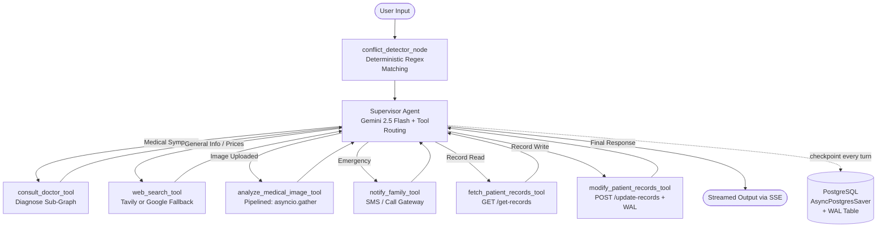
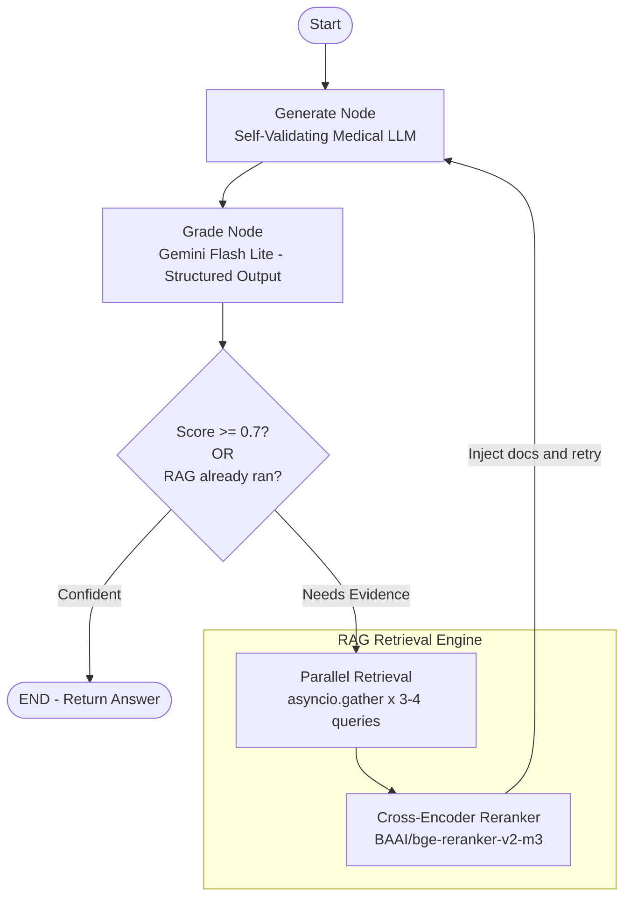
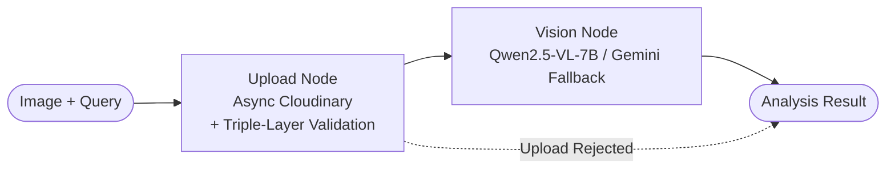
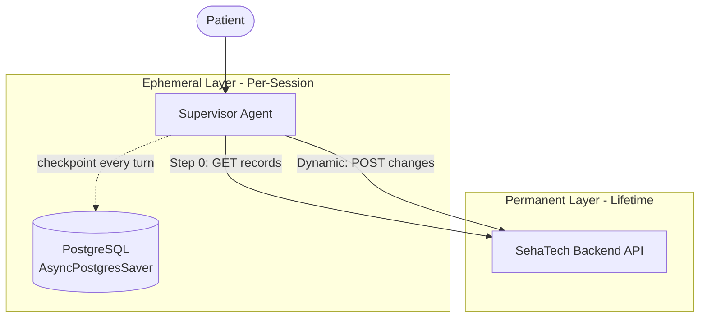
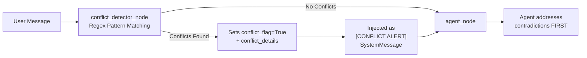

<div align="center">

# 🩺 SehaTech AI — Medical Inference Engine

[](https://www.python.org/downloads/)
[](https://fastapi.tiangolo.com)
[](https://langchain-ai.github.io/langgraph/)
[](https://www.postgresql.org/)
[](https://zilliz.com/)
[](https://huggingface.co/)
[](https://www.docker.com/)

**Production-grade Autonomous Medical Triage System** — featuring Deterministic Conflict Detection, Fault-Tolerant Write-Ahead Logging, Self-Healing Adaptive RAG, Pipelined Vision Analysis, Multi-Provider LLM Fallback, Triple-Layer Security, and Agentic Sub-Graph Orchestration for safe, hallucination-resistant diagnostic support.

</div>

---

## 🌟 Project Overview

**SehaTech AI** is a hierarchical **Agentic Medical System** designed to simulate a professional clinical triage process. It acts as a centralized Supervisor Agent that intelligently routes patient queries to specialized sub-systems — a **Deep Diagnostic Doctor** (Self-Healing RAG), **Web Search**, **Vision Analysis** (OCR/X-Ray), or **Emergency Family Notification** — based on real-time intent classification.

### What Makes This Different

| Capability | Traditional Chatbot | SehaTech AI |
|---|---|---|
| Latency Optimization | "Cold start" delays on first query | **Pre-warmed Models & Cached Graph** — pre-loads everything during server lifespan so you don't pay cold-start costs. |
| Diagnosis Quality | Single LLM call, no verification | **Self-Healing RAG Loop** — generates, grades, retrieves evidence, re-generates. |
| Memory | Lost on restart | **PostgreSQL-backed persistent chat history** with per-user thread management. |
| Data Integrity | Failed writes silently lost | **Write-Ahead Log (WAL)** — failed record updates queued in PostgreSQL, auto-retried at startup. |
| Reliability | Single API = single point of failure | **3-Tier LLM Fallback Chain** (HuggingFace → Groq → Gemini). |
| Security | Accepts file uploads raw | **Triple-Layer Validation** — strict MIME, 10MB limits, and exact Magic-Byte signature checks. |
| Safety | No contradiction checking | **Deterministic Conflict Detector** — regex-based, zero-latency, runs every turn. |
| Performance | Blocking, synchronous | **Async-first** with pipelined vision (asyncio.gather), lazy-loaded models, parallel retrieval. |

---

## 🏗️ System Architecture

### 1. Supervisor Agent — Tool-Based Triage Router

The Supervisor is a **Gemini 2.5 Flash**-powered LangGraph agent that classifies user intent and dispatches to specialized tools. It enforces the **"Golden Triangle"** protocol — collecting Symptoms, Duration, Severity, and Medical History before invoking diagnosis. A **Deterministic Conflict Detector** node runs before every agent turn.


```mermaid
flowchart TD
    Start(["User Input"]) --> CD["conflict_detector_node\n Deterministic Regex Matching"]
    CD --> Router["Supervisor Agent\n Gemini 2.5 Flash + Tool Routing"]

    Router -- "Medical Symptoms" --> DoctorTool["consult_doctor_tool\n Diagnose Sub-Graph"]
    Router -- "General Info / Prices" --> WebTool["web_search_tool\n Tavily or Google Fallback"]
    Router -- "Image Uploaded" --> VisionTool["analyze_medical_image_tool\n Pipelined: asyncio.gather"]
    Router -- "Emergency" --> FamilyTool["notify_family_tool\n SMS / Call Gateway"]
    Router -- "Record Read" --> FetchTool["fetch_patient_records_tool\n GET /get-records"]
    Router -- "Record Write" --> ModifyTool["modify_patient_records_tool\n POST /update-records + WAL"]

    DoctorTool --> Router
    WebTool --> Router
    VisionTool --> Router
    FamilyTool --> Router
    FetchTool --> Router
    ModifyTool --> Router

    Router -- "Final Response" --> End(["Streamed Output via SSE"])

    DB[("PostgreSQL\nAsyncPostgresSaver\n+ WAL Table")]
    Router -.-> |"checkpoint every turn"| DB
```

### 2. Self-Healing Adaptive RAG — The Diagnostic Engine

Unlike linear RAG pipelines, this system **generates first, judges second, and only retrieves if needed**. This "generate-then-verify" approach skips expensive vector search for simple queries while guaranteeing evidence-backed answers for complex cases.


```mermaid
flowchart TD
    Start(["Start"]) --> Generate["Generate Node\nSelf-Validating Medical LLM"]

    Generate --> GraderNode["Grade Node\nGemini Flash Lite - Structured Output"]

    GraderNode --> Router{"Score >= 0.7?\nOR\nRAG already ran?"}

    Router -- "Confident" --> End(["END - Return Answer"])
    Router -- "Needs Evidence" --> Retrieve

    subgraph RAG_Engine ["RAG Retrieval Engine"]
        direction TB
        Retrieve["Parallel Retrieval\nasyncio.gather x 3-4 queries"] --> Rerank["Cross-Encoder Reranker\nBAAI/bge-reranker-v2-m3"]
    end

    Rerank -- "Inject docs and retry" --> Generate
```

**Key design decisions:**
- **Confidence threshold = 0.7** — calibrated to allow strong parametric answers through while catching vague or unsafe responses.
- **Loop protection** — RAG runs at most once; if docs are already present, the system finishes regardless of score.
- **State stores text only** — `page_content` strings, not full `Document` objects, to prevent state serialization bloat.

### 3. Multimodal Vision Pipeline

A dedicated async sub-graph for medical image analysis — decouples I/O-bound upload from compute-bound vision inference.


```mermaid
flowchart LR
    S(["Image + Query"]) --> UP["Upload Node\nAsync Cloudinary\n+ Triple-Layer Validation"]
    UP --> VIS["Vision Node\nQwen2.5-VL-7B / Gemini Fallback"]
    VIS --> E(["Analysis Result"])
    UP -.-> |"Upload Rejected"| E
```

---

## ⚡ Architectural Highlights

### 🚀 Pre-Warmed Models & Graph Caching
Cold-start penalties are entirely mitigated. The LangGraph computational graph is asynchronously compiled and **cached in memory** strictly at server startup via the FastAPI `lifespan` context. Simultaneously, heavy dependencies (like the Gemma embedding model) are deliberately instantiated to **pre-warm the LLM weights**. Consequently, the system yields instant responsiveness for the very first incoming patient request so it **never pays the cold-start cost**.

### 🛡️ Triple-Layer Upload Security
To guard against injection vulnerabilities, Out-Of-Memory (OOM) crashes, or bandwidth depletion, all user imagery must clear three zero-trust defenses instantly:
1. **MIME Verification:** Enforces a strict `image/jpeg, png, webp` whitelist intercept.
2. **Hard Payload Cap:** Rejects anything over 10 MB synchronously before byte processing occurs.
3. **Magic-Byte Signatures:** Inspects the first 8 bytes of raw content (`FF D8 FF` / `89 50 4E 47` / `RIFF`) to catch malicious `.exe`/`.pdf` payloads masquerading with fake extensions, preventing processing before hitting Cloudinary.

### 💾 Write-Ahead Log (WAL) — Fault-Tolerant Record Persistence
For resilient backend communication under high load or network partitioning, the system maintains a persistent Write-Ahead Log (WAL) queue. If the external Health Backend API responds with a 500 error or a timeout while syncing a medical record, the modification is immediately persisted locally into `PostgreSQL` rather than failing silently. The `lifespan` daemon auto-flushes any uncommitted WAL queues asynchronously on server spin-up.

### 🏗️ Singleton ModelManager — Load Once, Serve Forever
A **thread-safe Singleton** architecture leveraging Double-Checked Locking manages all localized models. Instanced strictly once globally, averting disastrous Memory Leaks from duplicated object allocations while enforcing the modular Mixin patterns.

### 🔀 3-Tier LLM Fallback Chain
We assume unreliability from external APIs. Every core generation phase transitions systematically: **HuggingFace → Groq → Gemini**. If the primary provider hits a 429 Rate Limit or 503 Outage, it intercepts the exception, logs it, and routes smoothly down the chain with zero interruption to the user interface. 

### ⏱️ Pipelined Vision Analysis
Vision endpoints circumvent legacy synchronous bottlenecks. During photo uploads, **`asyncio.gather`** evaluates tasks collectively—cloud-uploading the image to CDN infrastructure while simultaneously rotating API proxy keys, slashing over `~250ms` from the TTL (Time-To-Live).

### 🗄️ Persistent Chat History (PostgreSQL)
Conversations survive Docker container restarts permanently using LangGraph's native **`AsyncPostgresSaver`** tethered to an **`AsyncConnectionPool`**. Database pools limit to `10` simultaneous connections for CPU conservation. Records fuse seamlessly with user IDs to resolve conversation multiplexing autonomously.

### 🌐 API Key Round-Robin (Thread-Safe)
Each LLM provider is equipped to accept multiple API Keys through the runtime environment. Invocations spin through keys utilizing an internal cyclic router secured by Python's native **`threading.Lock`** to eliminate concurrency race collisions.

---

## 🧠 Hybrid Memory Architecture (The Dual-Track Memory)

SehaTech operates on **two independent memory layers**, each optimized for a different time horizon:


```mermaid
flowchart TD
    User(["Patient"]) --> Supervisor["Supervisor Agent"]

    subgraph Ephemeral ["Ephemeral Layer - Per-Session"]
        direction LR
        PG[("PostgreSQL\nAsyncPostgresSaver")]
        Supervisor -.-> |"checkpoint every turn"| PG
    end

    subgraph Permanent ["Permanent Layer - Lifetime"]
        direction LR
        API["SehaTech Backend API"]
        Supervisor -- "Step 0: GET records" --> API
        Supervisor -- "Dynamic: POST changes" --> API
    end
```

### Ephemeral Layer — Per-Session Thread Persistence
Handled by LangGraph's `AsyncPostgresSaver`, this layer caches full dialog histories strictly for ongoing threads. It ensures continuity between utterances without inflating local memory scope footprint.

### Permanent Layer — Proactive Backend API Sync
Two custom LangChain Tools interact directly with central hospital software:
*   `fetch_patient_records_tool` (GET): Bootstraps knowledge from allergies, chronic files, or previous operative histories seamlessly when a session manifests.
*   `modify_patient_records_tool` (POST): Dynamically writes real-world clinical findings back to central APIs natively while speaking to the patient, queued gracefully via the **WAL** if offline.

---

## 🛠️ Tech Stack

| Component | Technology | Role |
|:---|:---|:---|
| **Orchestration** | LangGraph (StateGraph) | Multi-agent workflows with cyclic state and conditional routing |
| **Supervisor LLM** | Gemini 2.5 Flash | Intent classification and tool dispatch |
| **Medical LLM** | II-Medical-8B (HuggingFace) | Primary diagnostic generation |
| **Grading LLM** | Gemini 2.5 Flash Lite | Structured confidence scoring |
| **Fallback LLMs** | Groq (GPT-OSS-20B), Gemini | 3-tier fallback chain |
| **Vision LLM** | Qwen2.5-VL-7B-Instruct | Medical image OCR and analysis |
| **Embeddings** | Gemma-300M (256-dim, normalized) | Semantic vector representation |
| **Reranker** | BAAI/bge-reranker-v2-m3 (FP16) | Cross-encoder relevance scoring |
| **Vector DB** | Zilliz Cloud (Managed Milvus) | Medical document retrieval |
| **Persistence** | PostgreSQL + AsyncPostgresSaver | Durable chat history checkpointing (Ephemeral Layer) |
| **Backend API Sync** | httpx (AsyncClient) | Two-way patient record sync (Permanent Layer) |
| **Backend** | FastAPI | Async API with SSE streaming |

---

## 📁 Project Structure

```text
SehaTech/
├── Server/                      # Modular FastAPI Backend Package
│   ├── main.py                  # Core application, routers, lifecycle pre-warming
│   ├── config.py                # Logging, rate-limiting, and validation criteria
│   ├── schemas.py               # Pydantic JSON schemas (PrescriptionResponse, etc.)
│   ├── prompts.py               # Extracted System instructions & status mappers
│   ├── utils.py                 # Triple-Layer upload security & Cloudinary adapters
│   └── routers/
│       ├── chat.py              # Stateful SSE Streaming Chat endpoint
│       └── analyzers.py         # Stateless Vision Analysis OCR endpoints
├── Langgraphs/                  # Core Agent Configurations
│   ├── supervisor_graph.py      # Supervisor Agent + Lazy Factory
│   └── Diagnose_graph.py        # Self-Healing RAG Engine
├── Models/                      # LLM Managers & Mixins
│   ├── core_manager.py          # Mixin Base
│   ├── text_generation.py       # 3-Tier Chain Text Mixin
│   ├── vision_generation.py     # Pipelined Vision Mixin
│   ├── task_wrappers.py         # Sub-agents wrappers
│   └── Model_Manager.py         # Final Assembled Thread-safe Singleton
├── Tools/                       # Agentic Action Space
│   ├── Query_Optimization_Tool.py 
│   └── Post_validation_tool.py  # ... and others
├── Helper/                      # Integrations
│   └── HF_ApiManager.py         # Round-Robin providers
├── Database_Manager.py          # Write-Ahead-Log + SQL Persistence
├── server.py                    # Deployment Proxy → safely points to Server.main
├── prod.py                      # Production Cloud interface settings
└── docker-compose.yml           # Live containerized blueprints
```

---

## 💻 Installation & Setup

### 1. Clone the Repository

```bash
git clone https://github.com/yousseifmustafa/Health-AI-Gateway-Medical-Inference-Engine-.git
cd Health-AI-Gateway-Medical-Inference-Engine-
```

### 2. Run the Application

**Option A — Local Development:**
```bash
# Terminal 1: Start FastAPI backend (Note: backend entrypoint remains stable)
uvicorn server:app --host 0.0.0.0 --port 8000

# Terminal 2: Start Streamlit frontend
streamlit run app.py
```

**Option B — Docker (Production):**
```bash
docker-compose up --build
```

---

## 🧪 Testing Scenarios

The system has been meticulously tested against complex clinical circumstances:

| Test Case | What It Proves |
|---|---|
| 🧬 **"Fabry Disease" Cross-Reference** | Diagnosed a rare, multi-organ genetic disorder spanning cardiology and dermatology by pooling RAG retrieval logic across 4 domain corpora. |
| 🚫 **Anti-Hallucination Immunity** | Instantly rejected fabricated requests ("Purple Hiccups Syndrome") by analyzing low retrieval confidence matrices. |
| 🚨 **Emergency Escalation** | Triggered backend SMS sequences via `notify_family_tool` when correlating severe temporal signatures like "radiating jaw pain". |
| 🔄 **Auto-Repair Protocol** | First-pass LLM assessment output hit beneath `0.70`. Internal loop caught it, automatically queried vector DB locally, cited literature, and resubmitted without asking the user. |

---

## 🛡️ Medical Safety — Deterministic Conflict Detection Engine

A **deterministic, zero-latency safety layer** implemented as a dedicated LangGraph node (`conflict_detector_node`). It runs **before every agent turn**, using compiled regex patterns to catch contradictions between the patient's statements and their permanent records — **no LLM call required**.

### How It Works


```mermaid
flowchart LR
    Input["User Message"] --> CD["conflict_detector_node\nRegex Pattern Matching"]
    CD -- "No Conflicts" --> Agent["agent_node"]
    CD -- "Conflicts Found" --> Flag["Sets conflict_flag=True\n+ conflict_details"]
    Flag --> Inject["Injected as\n[CONFLICT ALERT]\nSystemMessage"]
    Inject --> Agent
    Agent --> Resolve["Agent addresses\ncontradictions FIRST"]
```

### Detection Patterns (English + Arabic)

| Pattern | Example User Statement | Record Contradiction |
|---|---|---|
| `no allergies` / `مفيش حساسية` | "I have no allergies" | Records show: Penicillin Allergy |
| `don't take` / `مش بآخد` | "I don't take any medications" | Records show: Metformin 500mg, Amlodipine 5mg |
| `no chronic` / `مفيش أمراض` | "I have no chronic conditions" | Records show: Type 2 Diabetes |
| `no surgeries` / `مفيش عمليات` | "Never had surgery" | Records show: Appendectomy (2019) |

### Why Deterministic > Prompt-Only

| Approach | Reliability | Latency | Cost |
|---|---|---|---|
| Prompt instructions (old) | ~80% — LLM may ignore under long context | 0ms | $0 |
| **Regex detector node (new)** | **100% — compiled patterns, deterministic** | **<1ms** | **$0** |

---

## 📐 Core Principles

1. **Never Crash** — Every component follows the pattern: try best option → fall back → graceful error message.
2. **Never Block** — All I/O is async or offloaded to thread pools; `asyncio.gather` pipelines parallel work to shrink compute cycles.
3. **Never Waste** — Lazy loading, caching compiled graphs, and pre-warming prevents latency bleeding so you don't pay cold-start costs.
4. **Never Forget** — PostgreSQL persistance + Write-Ahead Log (WAL) ensures no conversation or backend profile update is ever discarded silently.
5. **Never Hallucinate** — The Self-Healing RAG Loop + structured confidence grading terminates unsafe responses continuously.
6. **Never Miss a Conflict** — Deterministic regex detector catches contextual contradictions the LLM might overlook.
7. **Never Fly Blind** — Structured logging with hierarchical namespaces, rate limiting, exception intercepts, and health endpoints. 

---

<div align="center">

**Built with** ❤️ **by** [Yousseif Mustafa](https://github.com/yousseifmustafa)

*SehaTech AI — Because in healthcare, "I don't know" is exponentially better than a wrong answer.*

</div>
